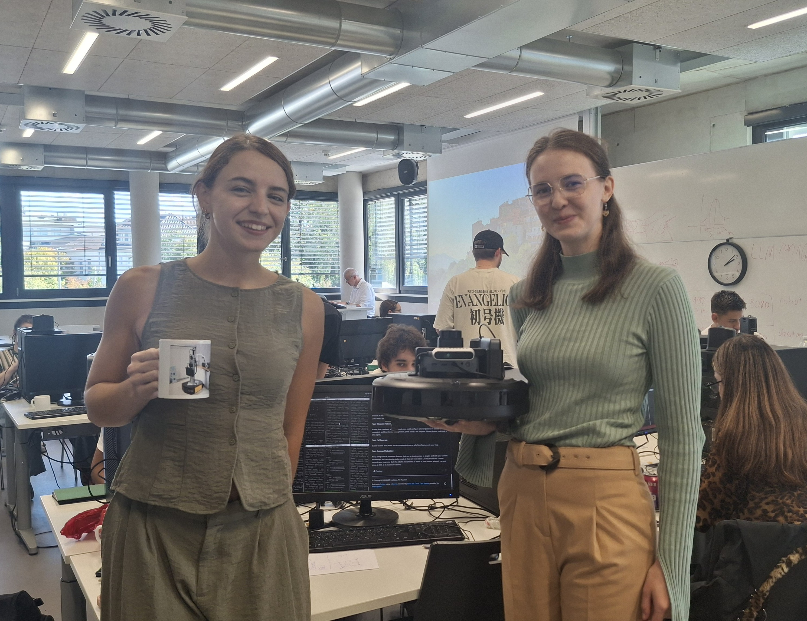
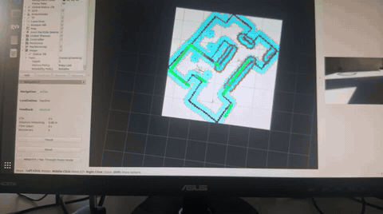
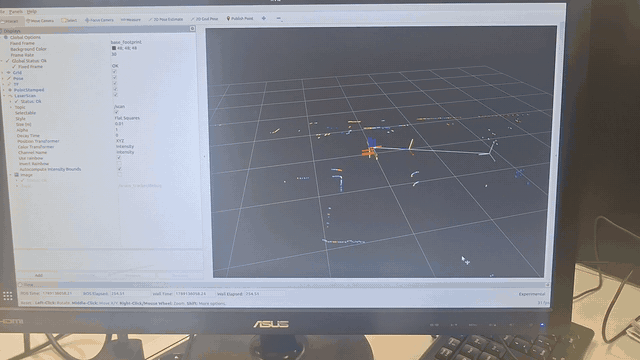
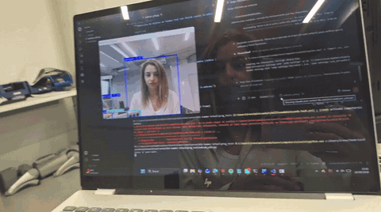

# ROS2 Autonomous Room Explorer



A ROS2 system for an iRobot Create3 that maps an arena, localizes itself in it and navigates to
goals with Nav2, and that can be driven in three ways: with a gamepad, with spoken movement
commands (Whisper speech-to-text + an LLM), and with hand gestures recognized by a custom-trained
YOLOv8 model.

Built during the **ROS2 Summer School** bootcamp at **FH Aachen**, as the final "Robot Challenge"
of the program, by [Irene Bernad de Olano](https://github.com/irene-bernad-de-olano) and
**Sofia Panitschewskaja**.

## What problem does it solve?

A mobile robot that is useful outside a simulator needs several capabilities working together at
once, not just in isolation:

1. Build a map of its environment and localize itself against it.
2. Navigate to a goal on that map, avoiding obstacles.
3. Understand what it sees through its camera.
4. Accept commands from a person in a natural way: by voice or by gesture, not only by joystick.

This project wires those building blocks (mapping, localization, navigation, perception, speech
and gesture interfaces) into one ROS2 workspace running on a real Create3.

## Why this project?

The bootcamp builds up these skills session by session — communication, TF, mapping/lidar,
localization, navigation, object detection, LLM-based control — and the final challenge is where
they all have to work together, live, on real hardware rather than in simulation. That last part
is what makes it interesting: a pipeline that works in RViz can still fail on the robot for
reasons simulation never surfaces (a wrong `use_sim_time` flag, a conflicting TF frame, a motion
command the robot's own safety watchdog cuts short) — see [Results](#results--what-we-learned)
below for the concrete issues we hit and fixed.

The system is operated in three modes:

- **Run 1 — Teleoperated:** the team drives the robot by gamepad, watching only the camera feed
  and the lidar scan (not the arena itself), while YOLOv8 detects objects in the camera image.
- **Run 2 — Voice commands:** the robot is controlled by spoken movement instructions such as
  *"move 1 meter forward, then turn 90 degrees to the left"*.
- **Run 3 — Hand gestures:** the robot follows hand signs shown to its camera (go forward, turn
  left, turn right, stop).

## Tech stack

**Robot platform**


iRobot Create3, RPLidar, RGB camera

**Perception, voice & gestures**


Ultralytics YOLOv8 (two models, see below), [whisper.cpp](https://github.com/ggerganov/whisper.cpp)
via `whisper_ros` for on-device speech-to-text, an LLM served by Ollama (`qwen3:4b`) to parse
spoken commands

**Tooling**


### YOLO models

`src/yolo_to_ros/yolo_to_ros/` contains two YOLOv8 models:

| Model | What it is | Used for |
|---|---|---|
| `yolov8n.pt` | Pre-built YOLOv8 nano model with the standard 80 COCO classes (person, chair, bed, toilet, oven…) | General object detection on the camera feed (Run 1, webcam demo) |
| `best.pt` | Our own model, trained to recognize hand gestures (oriented bounding boxes) | Gesture control (Run 3) |

## Project structure

This is a full `colcon` workspace (`src/<packages>`), not a single script. See
[Credits & third-party components](#credits--third-party-components) for where each package
comes from.

```text
ROS2-project/
├── README.md
├── LICENSE
├── .gitignore
├── media/                        # team photo, demo GIFs and original videos (see Demo below)
└── src/
    ├── robot_bringup/            # ★ lidar, camera, static TF tree, Create3 topic bridge
    ├── my_robot_slam/            # ★ SLAM Toolbox mapping + AMCL localization launch/config
    ├── my_robot_navigation/      # ★ Nav2 bringup and params
    ├── yolo_to_ros/              # ★ YOLOv8 detection nodes + both models (yolov8n.pt, best.pt)
    ├── turtlesim_llm/            # ★ Whisper→/user_command voice bridge + LLM movement controller
    ├── gesture_contol/           # ★ hand-gesture control of the robot (custom YOLO model)
    ├── room_explorer/            # room exploration + classification (work in progress)
    │
    ├── webcam_bringup/, tf_trans/, teleop/, pubsub/, my_first_pck/,   # exercises from
    │ follower_package/, test_package/                                 # earlier sessions
    │
    ├── whisper_ros/, rplidar-ros/, audio_common/,                     # third-party / vendored
    │ create3_examples/, ros_tutorials/, aruco_opencv_bringup/          # ROS packages
```

`★` marks the packages that make up the final system described below.

## Requirements

- ROS2 (Humble or later), `colcon`
- Nav2 (`navigation2`, `nav2_bringup`), `slam_toolbox`, `nav2_amcl`, `nav2_map_server`
- Python: `ultralytics` (YOLOv8), `opencv-python`, `cv_bridge`, `PyYAML`, `requests`
- An iRobot Create3 (or compatible diff-drive base publishing to `/cmd_vel` and TF), an RPLidar,
  and an RGB camera
- [whisper_ros](https://github.com/mgonzs13/whisper_ros) built against a local Whisper GGUF model
  for offline speech-to-text (Run 2)
- A reachable [Ollama](https://ollama.com) endpoint serving `qwen3:4b` or a similar model (Run 2)

## How to install and run it

```bash
mkdir -p ~/ros2_ws && cp -r src ~/ros2_ws/
cd ~/ros2_ws
colcon build --symlink-install
source install/setup.bash
```

> The YOLO nodes load their model from an absolute path set in the code
> (`/home/rss/sf_ws/src/yolo_to_ros/yolo_to_ros/...`). Adjust it to your workspace, or, for the
> gesture node, pass it as the `model_path` parameter.

**1. Map the arena and navigate with Nav2:**

```bash
ros2 launch robot_bringup robot.launch.yaml       # lidar, camera, static TF tree
ros2 launch my_robot_slam slam_toolbox.launch.yaml
# drive the robot around the arena, then save the map:
ros2 run nav2_map_server map_saver_cli -f src/my_robot_slam/maps/my_mymap1

# later, localize against the saved map and navigate:
ros2 launch my_robot_slam localization.launch.yaml  # map_server + AMCL
ros2 launch my_robot_navigation robot_nav.launch.py # Nav2 stack
# in RViz: set "2D Pose Estimate", then send a "Nav2 Goal"
```

**2. Run 1 — Teleoperated:**

```bash
ros2 launch robot_bringup robot.launch.yaml
ros2 launch create3_teleop teleop_launch.py        # gamepad teleop
ros2 run yolo_to_ros det                            # YOLOv8 (COCO) object detection
# the team drives by gamepad watching only RViz (camera + lidar)
```

**3. Run 2 — Voice commands:**

```bash
ros2 launch robot_bringup robot.launch.yaml
ros2 launch whisper_bringup whisper.launch.py       # Whisper speech-to-text
ros2 run turtlesim_llm voice_to_command             # bridges Whisper -> /user_command
ros2 run turtlesim_llm create3_llm_controller \
  --ros-args -p ollama_url:=http://<OLLAMA_SERVER_IP>:11434/api/generate
```

Then say e.g. *"move 1 meter forward, then turn right 90 degrees"*.

**4. Run 3 — Hand gestures:**

```bash
ros2 launch robot_bringup robot.launch.yaml
ros2 run gesture_contol gesture \
  --ros-args -p model_path:=$HOME/ros2_ws/src/yolo_to_ros/yolo_to_ros/best.pt
```

Show a hand sign to the camera: *up* → forward, *left* / *right* → turn, *stop* → stop. The
annotated camera image is published on `/gesture_detections` for viewing in RViz.

## How it works, in short

**Mapping, localization and navigation.** SLAM Toolbox builds an occupancy-grid map of the arena
while the robot is driven around it once. `nav2_amcl` then matches live lidar scans against that
saved map to track the robot's pose (`map -> odom -> base_link`), and Nav2 plans and follows a
path to any goal set in RViz.

**Run 2 — Voice commands.**

1. `whisper_ros` (whisper.cpp) transcribes speech on the robot's computer, with no cloud service.
2. `voice_to_command` keeps asking Whisper for the next utterance and republishes the text on
   `/user_command`. A watchdog cancels and restarts a request that hangs, which happens with
   `whisper_ros` when a clip transcribes to an empty string.
3. `create3_llm_controller` sends the text to an LLM (Ollama, `qwen3:4b`) with a prompt that makes
   it answer only with a JSON list of actions, e.g.
   `{"actions": [{"type": "move", "value": 1.0}, {"type": "turn", "direction": "right", "value": 90}]}`.
4. Each action is executed in order at a fixed speed for the time it takes to cover that distance
   or angle, republishing `/cmd_vel` every 0.5 s. Commands that arrive while a sequence is still
   running are ignored.

Voice control covers movement instructions only. Room-level instructions on the map, such as
*"go to the kitchen"*, were part of the challenge but we did not complete them — see
[Possible next steps](#possible-next-steps).

**Run 3 — Hand gestures.** The `gesture_control` node:

1. Runs our custom YOLOv8 model (`best.pt`) on every camera frame and keeps the most confident
   of the four gestures it acts on (*up*, *left*, *right*, *stop*), if above a 0.35 confidence
   threshold.
2. Only re-reads the gesture every 2 s, so a detection that flickers between frames doesn't make
   the robot switch commands constantly.
3. Publishes `/cmd_vel` at 10 Hz: *up* drives forward (0.15 m/s), *left* / *right* drive forward
   while turning (0.4 rad/s), and *stop* — or no gesture — stops the robot.
4. Stops the robot as a safety measure if camera images stop arriving (older than 0.5 s), and
   sends a final stop when the node is shut down.

## Demo

**Navigation with Nav2 on the saved map.** A goal is set in RViz with *Nav2 Goal* on the map
built with SLAM Toolbox, and the physical robot plans a path and drives to that point while AMCL
keeps it localized.

<p align="center">
  
</p>

**Robot TF tree and tag localization.** Every part of the robot (base, lidar, camera) is defined
as a TF frame, and the system detects fiducial tags with the camera and publishes each one's pose
in space as its own TF frame.

<p align="center">
  
</p>

**Real-time object detection with YOLOv8.** The pre-built `yolov8n.pt` model running live on a
webcam feed — the same detection node that runs on the robot's camera.

<p align="center">
  
</p>

Full-quality original videos are in [`media/`](media/).

## Results & what we learned

Getting the system working on hardware surfaced several issues that never show up until you
actually run the full stack on the robot rather than piece by piece:

- A stale `use_sim_time: true` left over from simulation-based testing, which silently stalls
  every Nav2 node on real hardware (no `/clock` topic is ever published).
- A conflicting TF tree: a static `base_footprint -> base_link` transform from our own bringup
  fighting the Create3 driver's own `odom -> base_link` broadcast, since both were claiming to be
  `base_link`'s parent.
- The Create3 stops on its own if `/cmd_vel` messages stop arriving for a moment, so a single
  "move for 5 seconds" message cut voice-commanded motions short. The controller now republishes
  the command for the whole duration of each movement.
- Gesture detections flicker from frame to frame, which made the robot jitter between commands.
  Reading the gesture at a slower, fixed rate while still publishing velocity at 10 Hz made the
  behavior stable without losing the ability to stop quickly.

None of these are visible in RViz playback or unit-level testing — they only show up once
localization, navigation and perception are all running together against the real robot's TF and
clock.

## Possible next steps

- Finish room-level voice commands (*"go to the kitchen"*): the `room_explorer` package already
  contains the first parts — visiting pre-surveyed waypoints in each room with Nav2, spinning in
  place while YOLO looks for typical furniture, and classifying each room — but it is not yet
  connected end to end with the voice pipeline.
- Replace the fixed waypoints per room with frontier-based exploration, so the system doesn't
  depend on knowing the room layout ahead of time.
- Train a custom YOLO model on the actual room pictures instead of relying on stock COCO furniture
  classes as a proxy.
- Use odometry feedback for voice-commanded movements instead of timed open-loop motion, so
  distances and angles are exact.

## Team

- **Irene Bernad de Olano** — [LinkedIn](https://www.linkedin.com/in/irene-bernad-de-olano-b33683270) 
- **Sofia Panitschewskaja** — [LinkedIn](https://www.linkedin.com/in/sofia-panitschewskaja-ba662a262/)

## Special thanks

- To **FH Aachen**, for organizing the ROS2 Summer School.
- To all the **tutors**, for helping us with our projects and pushing us to take on new challenges.
- To all the **participants**, for making the experience so enriching.

## Credits & third-party components

This repository is a full snapshot of the ROS2 workspace used throughout the bootcamp. Most of
its packages were developed following the course's tutorials and session exercises, and then
adapted, extended and integrated by us for the final challenge (for example, the gesture control
node, the Create3 voice controller and the custom-trained gesture model).

The workspace also includes third-party open-source ROS packages, used as-is and not written by
us: `whisper_ros`, `rplidar-ros`, `audio_common`, `create3_examples`, `ros_tutorials` and
`aruco_opencv_bringup`. Each keeps its own original license.

## License

Our own contributions are released under the [MIT License](LICENSE). Third-party and
course-provided material retains its original license.
